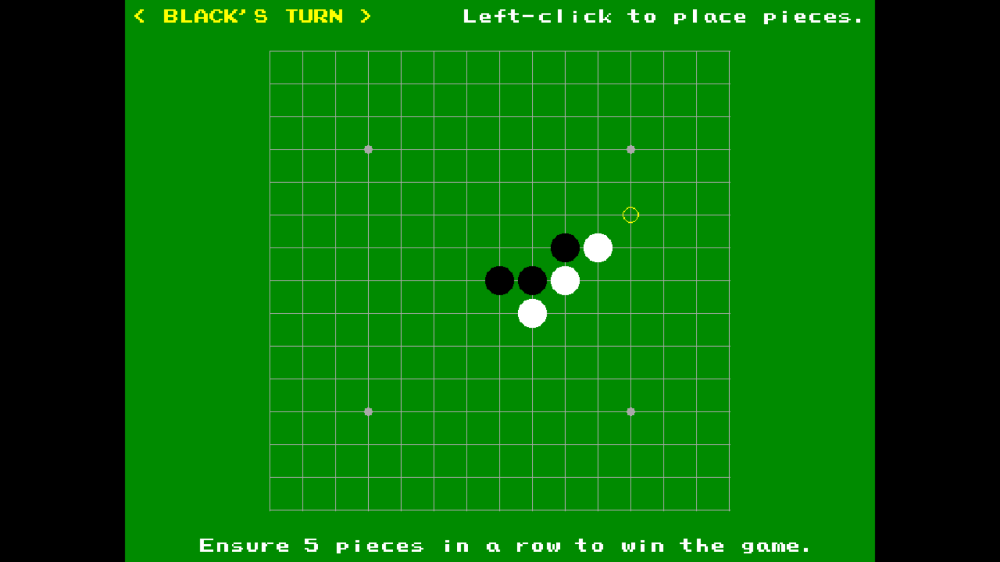

# Five-in-a-Row Game, Implemented with `vbPixelGameEngine` and Python



## Description

This project implements a classic Five-in-a-Row (Gomoku) game in two different programming languages:

- **VB.NET version**: Using @DualBrain's `vbPixelGameEngine` for graphics rendering
- **Python version**: Using the `pygame` library for graphics and game logic

Both implementations feature a 15x15 game board and follow the standard Five-in-a-Row rules, where players take turns placing black and white pieces on the board, aiming to be the first to get five pieces in a row (horizontally, vertically, or diagonally).

## Controls

- **Left Click**: Place a piece on the board
- **R**: Restart the game
- **Escape**: Exit the game

### Black Piece Special Rules

This implementation includes professional Gomoku rules that restrict certain moves for black pieces:

1. **Overline**: Black cannot form a line of more than 5 pieces in a row
2. **Double Three**: Black cannot create two open three patterns simultaneously
3. **Double Four**: Black cannot create two open four patterns simultaneously

**What constitutes an open pattern:**
- **Open Three**: A line of 3 same-colored pieces with empty spaces at both ends
- **Open Four**: A line of 4 same-colored pieces with empty spaces at both ends

When black attempts to make a move that violates these rules, the move is rejected, a violation message is displayed, and the turn skips to white. _White pieces are not subject to the above-mentioned restrictions._

## Features

### Common Features
- 15x15 game board with traditional star points
- Turn-based gameplay with black and white pieces
- Win detection for five-in-a-row patterns
- Professional Gomoku rules with black violation detection
- Restart game functionality
- Clear visual indicators for current player, game status, and rule violations

### Python Version Extras
- Enhanced visual effects with particle animations
- More detailed UI with shadows and highlights
- Smooth hover effects for valid moves
- Polished graphics with anti-aliasing

## Prerequisites 

- **VB.NET Version**:
  - [.NET 9.0 SDK](https://dotnet.microsoft.com/en-us/download/dotnet/9.0)
  - Visual Studio 2022/2026 or Visual Studio Code
  - vbPixelGameEngine library (included in the project)

- **Python Version**:
  - [Python 3.10+](https://www.python.org/downloads/)
  - Pygame library (install via `pip install pygame`)

## How to Install & Run
First, clone the repository and navigate to the project directory:
```bash
git clone https://github.com/Pac-Dessert1436/Five-in-a-Row-VBPGE-Python.git
cd Five-in-a-Row-VBPGE-Python
```

### VB.NET Version
1. Restore the project dependencies, then build and run the project:
```bash
dotnet restore
dotnet build
dotnet run
```
2. Alternatively, open the solution file `Five-in-a-Row.sln` in Visual Studio 2022/2026, and then build and run the project via the "Start" button or pressing F5.
3. The game will begin in a fullscreen mode.

### Python Version
1. Clone the repository or download the Python project files
2. Install the required dependencies using `pip install -r requirements.txt`
3. Run the script with this command, and the game will open in a window:
```bash
python five_in_a_row.py
```

## Technical Implementation

### VB.NET Version
- **Framework**: .NET 9.0
- **Graphics Engine**: vbPixelGameEngine
- **Key Components**:
  - `Program` class inheriting from `PixelGameEngine`
  - `Piece` enum for game state management
  - `CheckWin` function for win condition detection
  - `CheckBlackViolations` function for professional rule validation
  - `CheckOverline`, `CheckDoubleThree`, `CheckDoubleFour` functions for specific rule checks
  - `IsOpenThree` and `IsOpenFour` helper functions
  - `DrawBoard` and `HandlePlayerTurn` methods for game logic

### Python Version
- **Framework**: Python 3.x
- **Graphics Library**: Pygame
- **Key Components**:
  - `Piece` enum for game state
  - `check_win` function for win condition detection
  - `check_black_violations` function for professional rule validation
  - `check_overline`, `check_double_three`, `check_double_four` functions for specific rule checks
  - `is_open_three` and `is_open_four` helper functions
  - `draw_board` and `handle_player_turn` functions for game logic
  - `Particle` class for visual effects
  - Main game loop with event handling

## License
This project is licensed under the BSD 3-Clause License. See the [LICENSE](LICENSE) file for details.